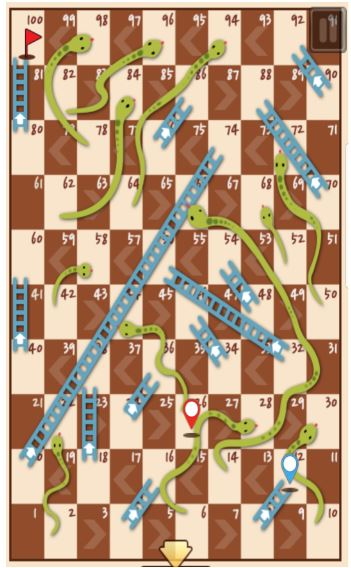

# Snakes & Ladders
C# Console application made in .NET Core for the game: Snakes and Ladders

## Requirements to run the code
Visual Studio 2017 or VS Code
.NET Core 2.2 framework

## Solution structure

This solution has two projects:
- A console application and
- XUnit test project for .Net Core

Both projects use Net Core 2.2 Framework.

## Game execution

By executing the Console application from Visual Studio, you will see the log of the players changing position in the board.

This implementation has two players, computer vs computer, that change position randomly, so any player can win.

The log shows the position of the player every time a player rolls a die, and also show a message if it finds a snake or ladder.

In addition, if a player is in the square 98 (considering the last position 100) and rolls a die and get 4, the player will remain in the same position, until get 2 or two times 1.

It is possible that two players land in the same position, when that happens, for my implementation there is no change, so I am not moving down any of the players. Other implements may do.

I didn't implement the option to clean the screen and play again. The main idea I had when starting doing it was to focus more on the Object Oriented part of the game and make it simple.

## Key decisions, design and code

In this section I will respond to these questions:
- How did you approach the problem?
- How did you make key design decisions and what alternatives did you consider?
- How do you envision your solution evolving in the future?

### How did you approach the problem?
1) I didn't know this game, so I installed the game on my cellphone and started playing to understand the game.
2) The first technical task I did was to identify all the objects of the game, known also as "Model domain objects".
3) Then identify the model responsibilities, for every object identified in point 2, I tried to respond the following questions:
   - What actions is this object responsible for? 
   - What information does this object share?  
4) Having a clear understanding of point 2 and 3, I created a class diagram, to design the interaction between objects.
5) I started coding using TDD 

### How did you make key design decisions and what alternatives did you consider?

The most important decision was to approach the problem with a "Responsibility-Driven Design":  Well-designed objects have clear responsibilities.

Following the objects identified and their responsibilities that you will be reflected in the code:
     
- __Player__: keeps track of his position and moves over squares of the board  
- __Die__: generate a random number from 1 to 6.
- __Square__: - knows its position in the board
                - knows all the players that are in that position 
                - knows how to assign a player to that position.
                - knows how to remove a player from that position
- __Snake__: is a special type of square that moves back a player when it lands in this square
- __Ladder__: is a special type of square that moves up a player when it lands in this square 
- __LastPosition__: is another type of square, that is the position number 100 for this implementation, this set a winner when a player lands in this position.
- __Board__: it contains the list of squares, snakes, and ladders. This became an important object in my implementation as it holds a collection of the square but also handle the events. I didn't want a single Square, Snake or Ladder to assign the player to another Square: it means having a recursive dependency with a board that contains the square, but every single square should know also the board in order to assign the player to another board. Example: if the player lands in position 50 and it is a snake that connects the square 50 and 25, the snake needs to have a dependency with the board to be able to assign the player to the position 25. Instead of that, the snakes and ladders publish an event that the board subscribes to it, so it passes the player and the position that need to be moved and the board does that. 
- __Game__: this object do the same as when you play a game on the computer or cellphone, the first screen will ask you about the options: your name, if you want to play against to computer or other users online, level od difficult, etc. My implementation of this function creates a board of 100 squares and two players. In addition, the board is exactly the same as in the picture above. So you have a ladder that connect the square 4 and 16 and snake that connects 2 and 22.
- __Play__: the play is the object than a player press to start the game and then, behind the scenes, there is a process that coordinate the game and keep track of the game state.

